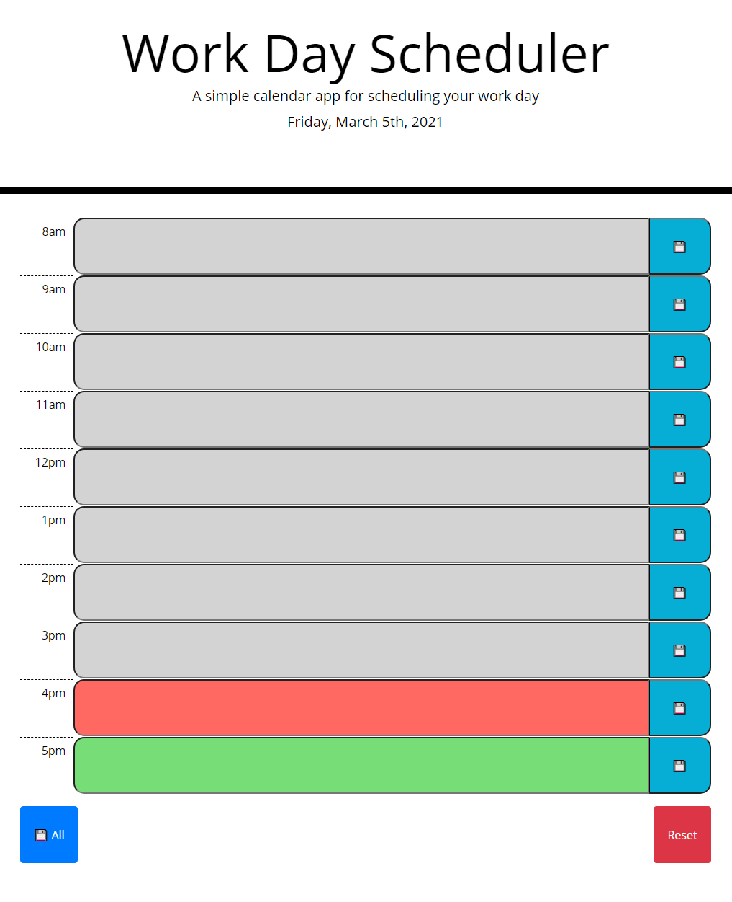

# Work-Day-Scheduler
Homework 5: Work Day Scheduler using JQuery and Moment.js

Link to the deployed page [here](https://matthewronaldjohnson.github.io/Work-Day-Scheduler/)

## Funactionality

Upon load the javascript will create rows for each buisness hour (here 8am - 5pm).

Each row has 3 features:  
    * A label that shows which hour the row represents  
    * A input area for users to type in their appointments  
    * And a save button to save events for that hour  

Using the data from moment.js, the page will color code each row's input area (grey for past, red for current hour, and green for future).

When the user types in an appointment in the input area and then clicks the save icon, the appointment will then stored in local storage to persit between sessions. 

On the bottom of the page are two buttons, one will save the contents of every input area and the other will clear the list of appointments. 

## Resources 

bootstrap docs on layout grids [link](https://getbootstrap.com/docs/4.5/layout/grid/)

MDN Doc on data attributes [link](https://developer.mozilla.org/en-US/docs/Learn/HTML/Howto/Use_data_attributes)
